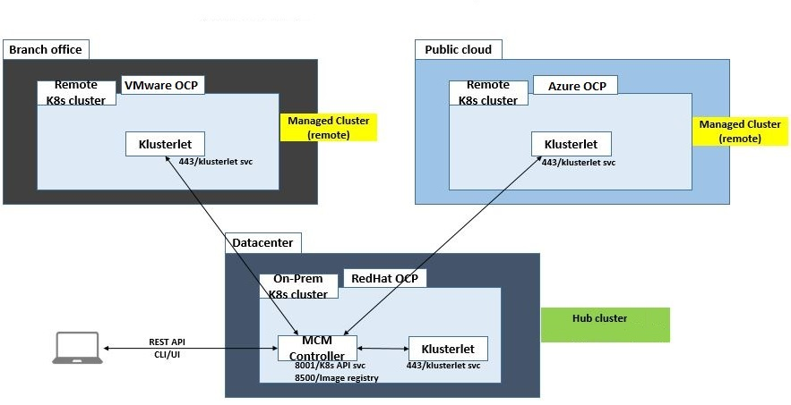

# RedHat Advanced Cluster Management (ACM) 2.0
Red Hat Advanced Cluster Management for Kubernetes offers end-to-end management visibility and control to manage your cluster and application life cycle, along with security and compliance of your entire Kubernetes domain across multiple datacenters and public clouds.

It provides a single view to manage your Kubernetes clusters—from Red Hat OpenShift deployed on premise and in public clouds, as well as clusters from public cloud providers like AWS, Microsoft Azure, Google, and IBM.

* [Product Documentation](https://access.redhat.com/documentation/en-us/red_hat_advanced_cluster_management_for_kubernetes/2.0/)
* [Architecture](https://access.redhat.com/documentation/en-us/red_hat_advanced_cluster_management_for_kubernetes/2.0/html/about/welcome-to-red-hat-advanced-cluster-management-for-kubernetes#multicluster-architecture)
    * Hub cluster (OCP 4.3.5 or OCP 4.4.x) available on Operator Hub
    * mcm-controller asynchronously aggregates multiple clusters of information and maintains the state of managed clusters and applications
    * Managed cluster (OCP > 3.11)
    * Klusterlet is the agent that initiates a connection to the Red Hat Advanced Cluster Management for Kubernetes hub cluster. The managed cluster receives and applies requests, then returns the results. 

    

* [Install & Demo](https://www.youtube.com/watch?v=4keQWJoFl7A)

Features & demo
1. [Cluster Lifecycle Overview](https://www.youtube.com/watch?v=1q9vVOsdSiw)
    * Full management (Create, Upgrade & Destroy) of OpenShift clusters running on-prem, public cloud as well as bare metal
        * Create cluster using IPI
        * Import cluster using UPI
        * Cluster upgrade on both imported & manged upgrade
        * Single pane of glass for all managed clusters 
    * Limited support of Public cloud managed k8s clusters like AKS, GKE, EKS
2. [Application Lifecycle Overview](https://www.youtube.com/watch?v=gKw-bJGYTQw)
    * Deploy workloads to specific clusters based on placement rules
    * Automatically deploy applications to specific clusters by subscribing to different channels (Github, hel repo, etc)
    * Quickly view the health of service endpoints and pods associated with the application topology
3. [Governance, Risk & Compliance](https://www.youtube.com/watch?v=aaeC2gYV57Q)
    * Pre-built security and configuration controllers to enforce policy on Kubernetes configuration, IAM, etc
    * Governance and risk dashboard across all of the clusters and applications

### Competing products
* Google GKE Anthos
* VMware Tanzu Mission Control
* Azure ARC
* Rancher